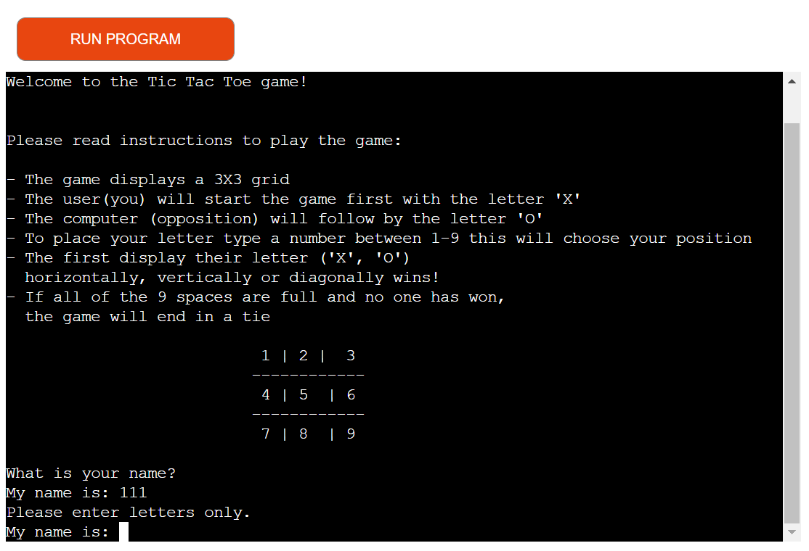
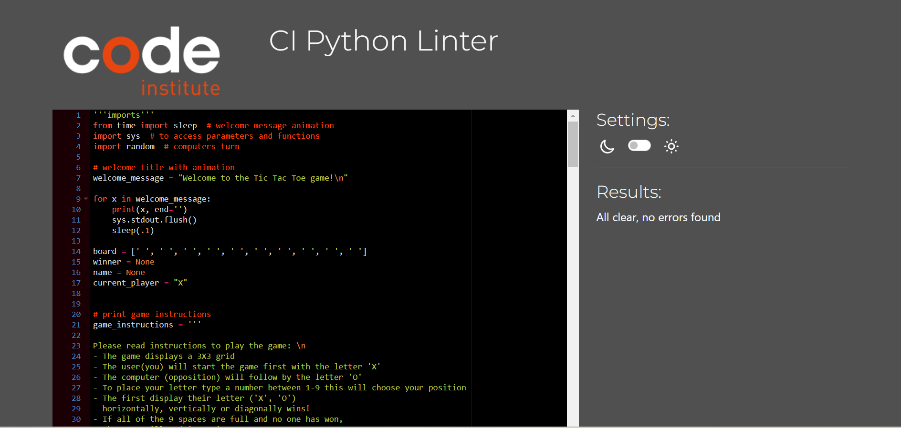

# Portfolio project - 3 Python

# Tic Tac Toe

Tic Tac Toe is a python terminal game, which runs in the Code Institute mock terminal on Heroku

## Introduction

Tic Tac Toe is a game where two players each take turns in choosing either an 'X' or an 'O' in one square of a grid consisting of nine squares, in this case the game is against the computer. The first player who gets 3 of the same letters('X' or 'O') wins the game this is achieved by having the same letters in horizontally, vertically or diagonally.

[Here is the live version of my project:](https://python-tic-tac-toe.herokuapp.com/)

[Here is a link to my GitHub repository:](https://github.com/AdamRalph123/tic-tac-toe)

# Table of contents
1. [Features](#features)
    * [Run programme](#run-programme)
    * [Name input](#name-input)
    * [Start game](#start-game)
    * [Check win](#check-win)
    * [Check tie](#check-tie)
    * [Game over](#game-over)
2. [User stories](#user-stories)
3. [Technology used](#technology-used)
4. [Testing](#testing)
5. [Bugs](#bugs)
6. [Future Features](#future-features)
7. [Deployment](#deployemnt)
8. [Credits](#credits)
9. [Acknowledgement](#acknowledgement)

# Features

## Run programme
when the user runs the progremme a welcome message will be shown, I uesed the sleep method so that the welcome message appears word by word. The game instructions appear so the user will know how to play the game and also a mock up board so the user will know how to input their chosen letter('X' or 'O').

## Name input
The user will be asked what their name is, letters will only be accepted as seen below.

## Start game 
After the user has entered their name a welcome message will appear and it will ask the user to type 'S' to start the game, a loading message will then appear saying 'game starting', the game board will then appear and ready for the user to play.

## Check win
If the user has won the game a message will appear saying 'you are the winner' if the computer has won it will say 'Oops the computer has won' and the game will the end.

## Check tie
If thr user or the computer has not won thr game will end in a tie and a message will appear saying 'its a tie' and the game will end. If the user has picked a spot thats already taken it will let the usre know and they will have to choose a differnt spot.

## Game over
After the ended in a win or tie a game over message will appear and it will ask the user if the want to quit the game, when pressed a thank you message will appear.

# User stories
As a player:
* I want to play a game with clear and easy instructions.
* I want a working game.
* I want messages to appear if i win, lose or tie.

# Technology used 
* Python
* JavaScript provided in the Code Institute Template
* HTML provided in the Code Institute Template

# Testing
Testing was conducted through out my entire project. Pep8 validator came back with no issues.

# Bugs 
I had a bug in my code when playing the game, if I won the game with enetering 3 inputs, the board would only show 2 inputs instead of three, I fixed this bug by adding print_board(board) in my check_win function.

# Future features
If was to make this game again I would add a scoreboard so the user can keep track of their score and I would also add a timer to make the game more intense.

# Deployment
Steps for deployment:
* Create a new heroku app
* Set the buildbacks to python and nodejs in that order
* Link the heroku app to the repository
* Click on deploy

# Credits 
<u>YouTube</u>

Some of my code was done by watching YouTube tutorials from (https://www.youtube.com/@CodeCoachh)

<u>Research</u>

(https://www.w3schools.com/) helped me with my research and understanding.

 # Acknowledgement
 I would like to thank;
 
 * My mentor [Jubril Akolade](https://www.linkedin.com/in/jubrillionaire/) who is always there for support and to answer any questions i have for him.
 * The slack community (https://slack.com/intl/en-ie/https://slack.com/intl/en-ie/) which i can always rely on.
 * I would like to thank the assessment team for taking their time to look over my project.
